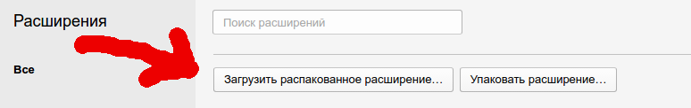

# Toster wysiwyg panel

- - -
[](https://travis-ci.org/yarkovaleksei/toster-wysiwyg-panel) [](https://david-dm.org/yarkovaleksei/toster-wysiwyg-panel.svg)

### Расширение для браузеров Opera и Google Chrome

**Расширение добавляет функционал редактора формы ответа к форме комментария для сайта [toster.ru](https://toster.ru)**

[](img/screen.png)

- - -
### Build

```bash
$ npm run compile
```

- - -
### Create zip for publish

```bash
$ npm run zip
```

- - -
### Install

[Chrome web store](https://chrome.google.com/webstore/detail/toster-wysiwyg-panel/kpfolongmglpleidinnhnlefeoljdecm?hl=ru&gl=RU)  [](https://chrome.google.com/webstore/detail/toster-wysiwyg-panel/kpfolongmglpleidinnhnlefeoljdecm?hl=ru&gl=RU)

Opera web store - (ожидание публикации)

**Установка из репозитория:**

```bash
$ git clone git@github.com:yarkovaleksei/toster-wysiwyg-panel.git TWP
$ cd ./TWP
$ npm install
```

Теперь открываем браузер (на примере Opera):

1. Жмем Ctrl+Shift+E
2. Нажимаем кнопку как на скрине
[](img/opera1.png)
3. Выбираем нашу папку TWP и жмем кнопку Open

Готово! Теперь можно пользоваться комментами Тостера и не нервничать :smile:
