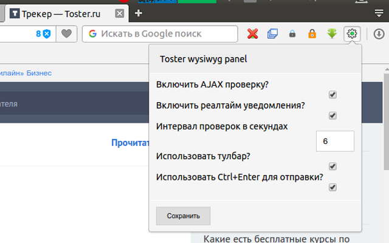
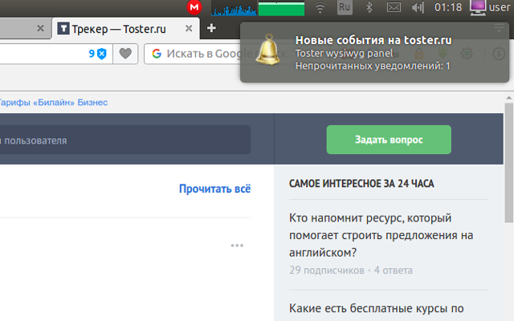
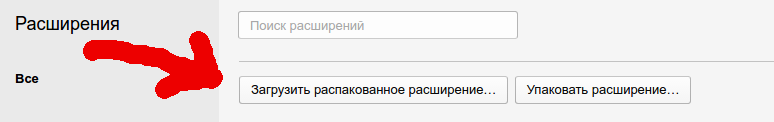
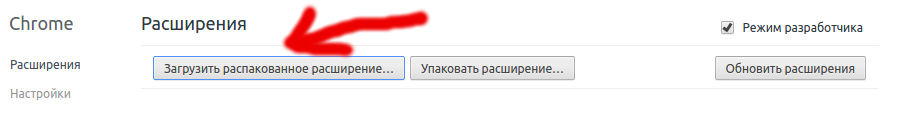
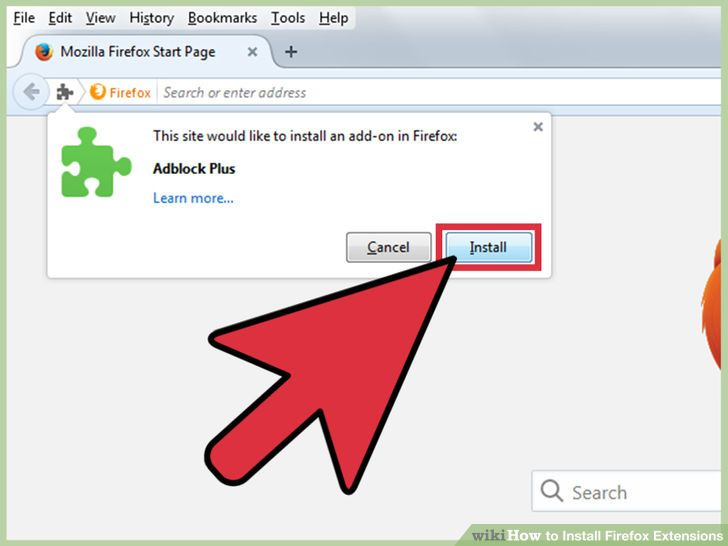

# Toster wysiwyg panel

[](https://github.com/yarkovaleksei/toster-wysiwyg-panel/releases/latest)  [](https://travis-ci.org/yarkovaleksei/toster-wysiwyg-panel)  [](https://david-dm.org/yarkovaleksei/toster-wysiwyg-panel.svg)  [](https://chrome.google.com/webstore/detail/toster-wysiwyg-panel/kpfolongmglpleidinnhnlefeoljdecm?hl=ru&gl=RU)  [](https://chrome.google.com/webstore/detail/toster-wysiwyg-panel/kpfolongmglpleidinnhnlefeoljdecm?hl=ru&gl=RU)

- - -
+ [Описание](#Описание)
+ [Установка](#Установка)
+ [Установка из репозитория](#Установка-из-репозитория)
+ [Установка в Opera](#Установка-в-Opera)
+ [Установка в Google Chrome](#Установка-в-Google-Chrome)
+ [Установка в Firefox](#Установка-в-Firefox)
+ [Разработчикам](#Разработчикам)
+ [Подготовка к работе](#Подготовка-к-работе)
+ [Сборка](#Сборка)
+ [Упаковка в zip перед публикацией](#Упаковка-в-zip-перед-публикацией)
+ [Подписывание расширения для Firefox](#Подписывание-расширения-для-Firefox)

- - -
# Внимание

## Актуальная версия расширения только для Google Chrome

Opera и Firefox долго пропускают расширение для публикации. 

Если расширение недоступно по приведенной ссылке, то используйте установку из zip-архива, как описано [здесь](#Установка-из-репозитория)

- - -
### Описание

**Расширение для браузеров [Google Chrome](https://chrome.google.com/webstore/detail/toster-wysiwyg-panel/kpfolongmglpleidinnhnlefeoljdecm), Opera и [Firefox](https://addons.mozilla.org/en-US/firefox/addon/toster-wysiwyg-panel/)**

**Что умеет расширение?**

1. Расширение добавляет функционал редактора формы ответа к форме комментария для сайта [toster.ru](https://toster.ru)
2. Возможность отправки ответа или комментария нажатием комбинации Ctrl+Enter
3. Проверка новых уведомлений без перезагрузки страницы (опция и интервал проверки включается в настройках)
4. HTML5 Notification уведомление, клик по которому откроет страницу со списком уведомлений
5. Комбинация Alt+T открывает popup с настройками
6. Добавлена возможность отключать и включать все опции в настройках:
    - Включить/отключить AJAX проверку
    - Включить/отключить HTML5 уведомления
    - Интервал AJAX проверки в секундах
    - Включить/отключить тулбар с кнопками
    - Включить/отключить отправку сообщения комбинацией Ctrl+Enter

- - -
[](img/screen-form.png)

[](img/screen-settings.png)

[](img/screen-notify.png)

- - -
### Установка

[](https://chrome.google.com/webstore/detail/toster-wysiwyg-panel/kpfolongmglpleidinnhnlefeoljdecm)  [](https://addons.mozilla.org/en-US/firefox/addon/toster-wysiwyg-panel/)  

- - -
### Установка из репозитория

Скачиваем [отсюда](https://github.com/yarkovaleksei/toster-wysiwyg-panel/releases/latest) нужный файл для своего браузера:

- Opera и Google Chrome - **source.zip**
- Firefox - *.xpi файл расширения

- - -
#### Установка в Opera

Распаковываем архив:

```bash
$ cd ~/Загрузки
$ unzip source.zip -d ./source
```

Теперь открываем браузер:

1. Жмем Ctrl+Shift+E
2. Нажимаем кнопку как на скрине

3. Выбираем нашу папку (source), куда распакован архив, и нажимаем кнопку "Open"

- - -
#### Установка в Google Chrome

Распаковываем архив:

```bash
$ cd ~/Загрузки
$ unzip source.zip -d ./source
```

Теперь открываем браузер:

1. Вводим в строку браузера *chrome://extensions/*
2. Нажимаем кнопку как на скрине

3. Выбираем нашу папку (source), куда распакован архив, и нажимаем кнопку "Open"

- - -
#### Установка в Firefox

1. Нажимаем правой кнопкой мыши на скачанный xpi файл. Имя файла примерно такое: *toster_wysiwyg_panel-X-X-X-xxxx.xpi*
2. Выбираем в контекстном меню пункт "Открыть с помощью..."
3. Выбираем из предложенных вариантов Firefox

Откроется браузер:

1. Нажимаем кнопку как на скрине


- - -
Готово! Теперь можно пользоваться Тостером и не нервничать :smile:

- - -
### Разработчикам

- - -
#### Подготовка к работе

```bash
$ git clone git@github.com:yarkovaleksei/toster-wysiwyg-panel.git
$ cd toster-wysiwyg-panel
$ npm install
```

- - -
#### Сборка

```bash
$ npm run compile
```

- - -
#### Упаковка в zip перед публикацией

```bash
$ npm run zip
```

- - -
#### Подписывание расширения для Firefox

Чтобы иметь возможность подписать файл для Firefox надо пройти по [этой ссылке](https://addons.mozilla.org/en-US/developers/addon/api/key/) и сохранить ваши ключи в файл .jwtsign в папке репозитория.

Файл должен выглядеть так:

```bash
APIKEY="user:123456789:999"
SECRETKEY="e1373f71d00aad90183b410c2e8661265a71845fd0805bd2bdca5fe66a635cfb"
```

Команда для создания и подписи файла:

```bash
$ npm run ffsign
```
