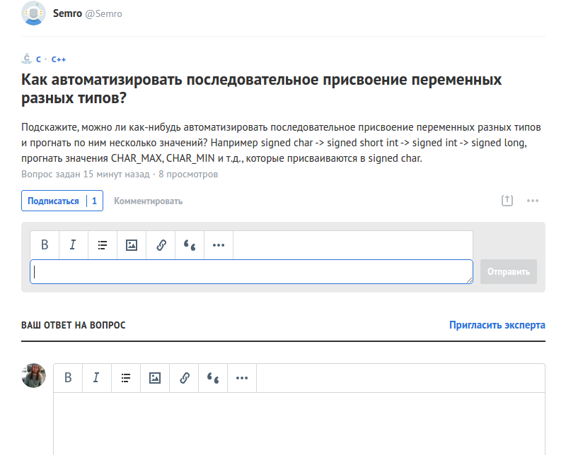

# Toster wysiwyg panel

- - -
[](https://travis-ci.org/yarkovaleksei/toster-wysiwyg-panel) [](https://david-dm.org/yarkovaleksei/toster-wysiwyg-panel.svg)

- - -
### Добавляет функционал редактора формы ответа к форме комментария

[](screen.png)

- - -
### Build

```bash
$ npm run compile
```
