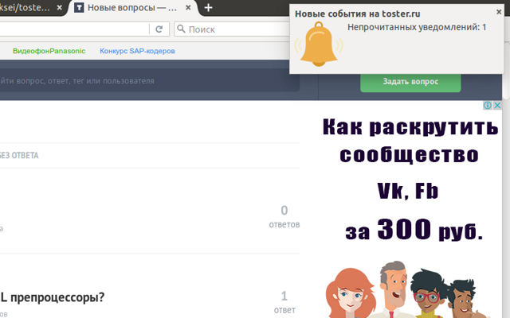

# {{TITLE}} v{{VERSION}} 

- - -
### Описание

**Расширение для браузеров [Google Chrome](https://chrome.google.com/webstore/detail/{{EXT_REPO}}/kpfolongmglpleidinnhnlefeoljdecm), [Opera](https://addons.opera.com/ru/extensions/details/{{EXT_REPO}}/) и [Firefox](https://addons.mozilla.org/en-US/firefox/addon/toster-wysiwyg-panel/)**

- - -
    

- - -
**Что умеет расширение:**

1. Живое обновление ответов и комментариев к вопросу
2. Живое обновление ленты вопросов
3. Живое обновление непрочитанных уведомлений
4. Возможность отправки ответа или комментария нажатием комбинации <kbd>Ctrl+Enter</kbd>
5. Возможность задать подпись в HTML формате дял ответов и комментариев
6. Возможность скрывать правый сайдбар сайта
7. Возможность скрывать верхнюю панель со ссылками ТМ
8. Возможность менять отображение шрифта в поле ввода ответа и комментария
9. Быстрый переход на страницу добавления нового вопроса и на страницу трекера
10. HTML5 Notification уведомление, клик по которому откроет страницу со списком уведомлений
11. Вывод количества непрочитанных уведомлений на иконке расширения
12. Звуковое уведомление для каждого события. Выбрать мелодию можно в настройках.
13. Комбинация <kbd>Alt+T</kbd> открывает popup с настройками
14. Возможность включать и отключать все опции в настройках

- - -

- - -
### Примечание

Если расширение недоступно по приведенной ссылке, то используйте установку из zip-архива (**Opera**, **Chrome**) или из **xpi** (**Firefox**), как описано [здесь](tutorial-Установка%20из%20репозитория.html)
